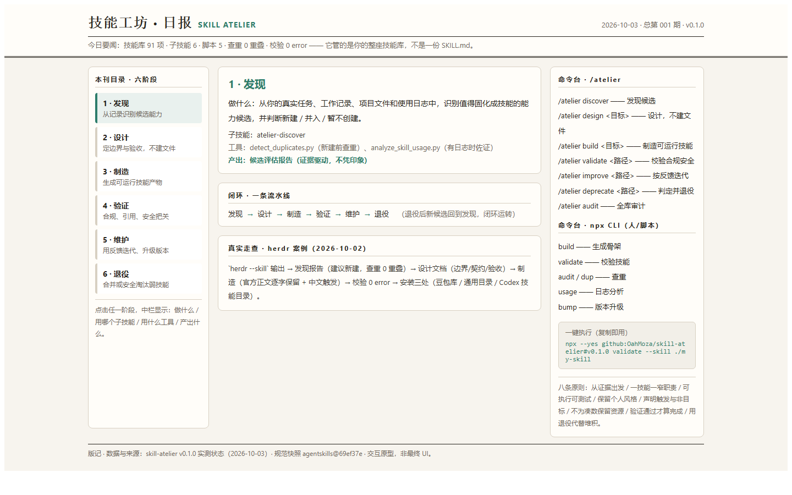

# Skill Atelier · 匠心技能工坊

个人元技能（meta-skill）制造与治理系统：围绕你的真实任务、工作记录、团队规范和使用反馈，持续**发现 → 设计 → 制造 → 验证 → 维护 → 退役** Agent Skills。

它与"批量生成 SKILL.md"的工具的根本区别：后者产单份文件，本项目维护**整座个人技能库**——判断什么值得做成技能、按你的个人风格制造、校验合规、用使用证据迭代、对弱技能退役。

## 目录结构

```
skill-atelier/
├── SKILL.md                        # 元技能本体（触发路由 + 生命周期指引）
├── profile.yml                     # 个人配置：语言/风格/风险偏好/目录（可改）
├── README.md                       # 本文件
├── CHANGELOG.md                    # 版本变更记录
├── docs/                           # 可视化：交互式产品原型 + 整体使用（日报风）页面
├── references/                     # 只读参考（规范快照、方法论、反模式）
│   ├── agentskills-spec.md         #   官方规范快照（commit 69ef37e, 2026-09-29）
│   ├── skill-design-principles.md
│   ├── trigger-optimization.md
│   ├── lifecycle-management.md
│   ├── personal-context-template.md
│   └── anti-patterns.md
├── scripts/                        # 可执行工具（Python 3，仅标准库）
│   ├── scaffold_skill.py           #   生成规范骨架
│   ├── validate_skill.py           #   校验 frontmatter/结构/引用/权限/安全
│   ├── detect_duplicates.py        #   技能库查重
│   ├── analyze_skill_usage.py      #   使用日志 → 维护优先级
│   └── bump_version.py             #   版本升级 + 变更记录
├── assets/
│   └── templates/
│       ├── SKILL.md.tmpl           #   通用模板
│       ├── workflow-skill.tmpl     #   流程类技能模板
│       ├── tool-skill.tmpl         #   工具/脚本类技能模板
│       ├── governance-skill.tmpl   #   治理/元类技能模板
│       └── profile.yml.tmpl        #   个人配置模板
└── skills/                         # 内部子技能（生命周期各阶段入口）
    ├── atelier-discover/
    ├── atelier-design/
    ├── atelier-build/
    ├── atelier-validate/
    ├── atelier-maintain/
    ├── atelier-audit/
    └── atelier-deprecate/
```

## 原型与可视化

想 30 秒看懂这个 skill 怎么运转，打开 [交互式产品原型](docs/skill-atelier-prototype.html)：六阶段生命周期管道（点击查看每阶段用什么子技能/工具、产出什么）+ 包解剖 + 命令台 + 八条原则。

想从"整体怎么用"的角度看，打开 [整体使用 · 工坊日报](docs/skill-atelier-usage.html)：日报风三栏版面——本刊目录（六阶段可点击切换）、本期版面（阶段详情 / 闭环 / 真实走查 herdr 案例）、命令服务栏（/atelier 与 npx CLI），一页讲清整座技能库怎么运转。



## 快速开始

```bash
# 1. 新建技能骨架
python scripts/scaffold_skill.py --name my-skill --type workflow --description "做什么 + 何时用"

# 2. 校验
python scripts/validate_skill.py --skill ./my-skill

# 3. 查重（新建前）
python scripts/detect_duplicates.py --skills-dir .

# 4. 维护优先级（有使用日志时）
python scripts/analyze_skill_usage.py --log usage.log.jsonl

# 5. 升级版本
python scripts/bump_version.py --skill ./my-skill --message "加入 gotchas 修正"
```

## npx 直接执行（无需 npm publish）

仓库根目录已声明 `bin` 且入口文件带 shebang，可被 npx 从 GitHub 直接执行：

```bash
# 走默认分支
npx --yes github:OahMoza/skill-atelier

# 锁定版本（生产环境建议写死，别依赖 main）
npx --yes github:OahMoza/skill-atelier#v0.1.0

# 子命令示例
npx --yes github:OahMoza/skill-atelier validate --skill ./my-skill
npx --yes github:OahMoza/skill-atelier build --name my-skill --type workflow --description "把周报整理固化为流程"
```

CLI 支持：`build` / `validate` / `audit` / `usage` / `bump` / `help` / `version`。
`discover` / `design` / `improve` / `deprecate` 是智能体驱动的判断流程，没有脚本实现，交给元技能本体（`/atelier` 命令）。

**依赖说明**：CLI 是零依赖 Node 薄壳，实际调度 `scripts/` 下的 Python 脚本（仅标准库），因此本机需有 Python 3（Windows 为 `python`，macOS/Linux 为 `python3`）。tarball 不含 node_modules，本包无构建步骤，无需 `prepare`。

## 交互命令

以 `/atelier` 开头：`discover` / `design` / `build` / `validate` / `improve` / `deprecate` / `audit`。完整说明见 `SKILL.md`。

## 个人化

编辑 `profile.yml`（或放到 `~/.skill-atelier/profile.yml`）：
- `language: zh-CN`、`output_style: concise`；
- `risk_tolerance` 与 `require_confirmation_for`（文件删除、git push、云部署、数据库写等高风险操作）；
- `directories.skills`：技能安装目录。默认 `~/.agents/skills`；若运行在豆包工作区，可改为当前环境的技能根目录（如 `.user_skills` 所在路径）。

## 规范来源

- [agentskills/agentskills](https://github.com/agentskills/agentskills)（Apache-2.0）官方 Agent Skills 规范，快照见 `references/agentskills-spec.md`。
- 兼容策略：官方字段（name、description）原样遵守；version / permissions / dependencies / platforms 为扩展字段，单独声明。
